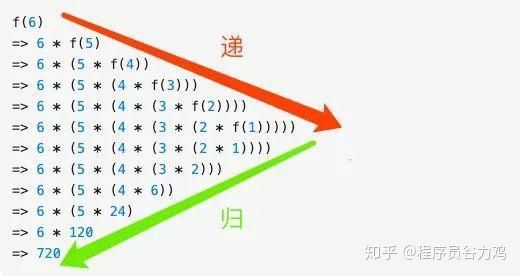
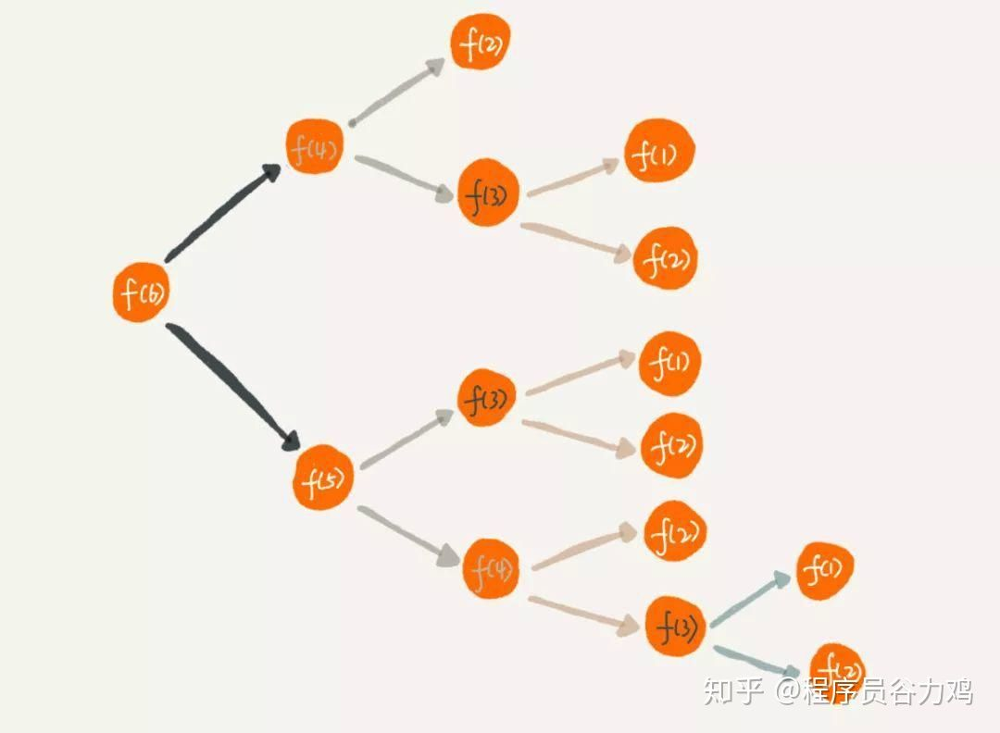
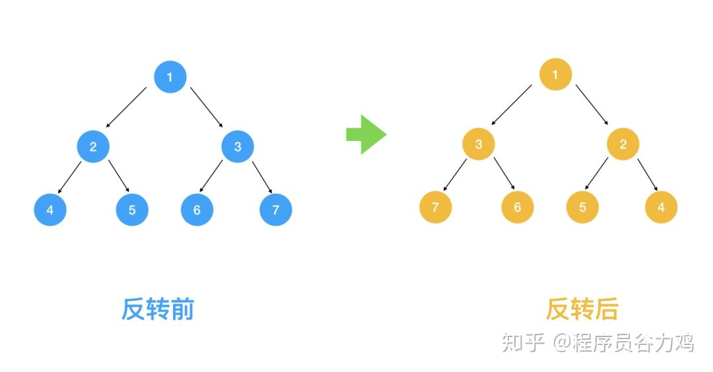
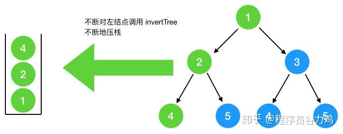
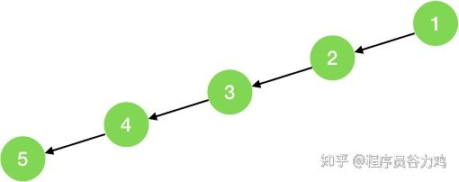

# 前言

这个玩意对于我这种菜鸟来说，说着容易做着难，道理都懂，就是写不出来，应该是没有系统性的来做，今天打算一举拿下。

# 递归随想

## 先处理OR先递归？

我学递归的时候对这个问题是相当的迷惑，有的题目是先处理，有的题目是先递归，还有的题目是二者都可以，那么这二者究竟是有什么渊源呢？

先来看个demo？我们先来看二叉树镜像的例子。

```java
// 先递归
public TreeNode invertTree(TreeNode root) {
    // 叶子结果不能翻转
    if (root == null) {
        return null;
    }
    // 翻转左节点下的左右节点
    TreeNode left = invertTree(root.left);
    // 翻转右节点下的左右节点
    TreeNode right = invertTree(root.right);

    // 左右节点下的二叉树翻转好后，翻转根节点的左右节点
    root.right = left;
    root.left = right;
    return root;
}
// 先处理
public void Mirror(TreeNode root) {
  if(root == null)//非法输入
    return;
  if(root.left == null && root.right == null)
    return;
  TreeNode temp = root.left;
  root.left = root.right;
  root.right = temp;
  Mirror(root.left);
  Mirror(root.right);
}
```

最开始我的猜测是返回值的问题，这个最容易猜测，后面发现并不是这样。经过和别人的交流是这样的。

对于该问题来讲，无论我们是先反转该节点的左右子树(先处理)，还是先找子节点的左右子树(先递归)，是一样的，因为是对称的。

> 我们把先解决该问题，在递归解决子问题的情况称做**尾递归**。

定义如下：当递归调用是函数体中最后执行的语句并且它的返回值不属于表达式一部分时， 这个递归就是尾递归。

并且编辑器会对尾递归进行优化，可以复用栈帧。

那么是不是所有的递归都可以转成尾递归呢？答案是否定的。不过尾递归可以和循环相互转化，在现在的面试题目中，面试官经常让我们不要用递归，那么尾递归直接改成循环。非尾递归咋办呢？我们可以使用栈来模拟吧。

上面的例子是先递归，先处理都可以，那么有没有只能先递归，在处理呢？

这种例子是，f(n)依赖f(n-1),并且f(n-1)没有计算出来的情况下，n这个点是无法来处理的。比如[从尾到头打印链表](https://github.com/haojunsheng/AlgorithmNotes/blob/master/src/com/code/linkedList/PrintListInReversedOrder_06.java)。

此外，树的先中后序遍历是个很好的例子。

树的先序遍历中，我们就是先处理，在递归。树的后序遍历中，我们是先解决子问题，在解决根问题。

其中，树的中序遍历就更特殊了，这种的思路是，先解决一半子问题，在解决该问题，最后解决剩下的子问题，先递归，在处理，在递归的思想，此外，汉诺塔问题也用到了该思路。


做递归题目的时候，尤其是先递归的时候，注意，后面的变量和递归之前是同样的地位，都是当前要处理的节点。

**切忌在每一个子问题上层层展开死抠**，这样就容器陷入死循环。

# 定义


# 套路

递归的特点：

- 一个问题可以分解成具有**相同解决思路**的子问题，子子问题，换句话说这些问题都**能调用同一个函数**
- 经过层层分解的子问题最后一定是有一个不能再分解的固定值的（即终止条件）,如果没有的话,就无穷无尽地分解子问题了，问题显然是无解的。

经过判断可以用递归后，接下来我们就来看看用递归解题的基本套路（四步曲）：

1. 先定义一个函数，**明确这个函数的功能**，由于递归的特点是问题和子问题都会调用函数自身，所以这个函数的功能一旦确定了， 之后只要找寻问题与子问题的递归关系即可。
2. 接下来寻找问题与子问题间的关系（即**递推公式**），这样由于问题与子问题具有**相同解决思路**，只要子问题调用步骤 1 定义好的函数，问题即可解决。所谓的关系最好能用一个公式表示出来，比如 **f(n) = n \* f(n-)** 这样，如果暂时无法得出明确的公式，用伪代码表示也是可以的, 发现递推关系后，**要寻找最终不可再分解的子问题的解**，即（临界条件），确保子问题不会无限分解下去。由于第一步我们已经定义了这个函数的功能，所以当问题拆分成子问题时，子问题可以调用步骤 1 定义的函数，符合递归的条件（函数里调用自身）
3. 将第二步的递推公式用代码表示出来补充到步骤 1 定义的函数中
4. 最后也是很关键的一步，根据问题与子问题的关系，推导出时间复杂度,如果发现递归时间复杂度不可接受，则需**转换思路对其进行改造**，看下是否有更靠谱的解法

# 实战

## 阶乘函数

- 定义这个函数，明确这个函数的功能，我们知道这个函数的功能是求 n 的阶乘, 之后求 n-1, n-2 的阶乘就可以调用此函数了

```java
/**
 * 求 n 的阶乘
 */
public int factorial(int n) {
}
```

- 寻找问题与子问题的关系 阶乘的关系比较简单， 我们以 f(n) 来表示 n 的阶乘， 显然 f(n) = n * f(n - 1), 同时临界条件是 f(1) = 1,即


- 将第二步的递推公式用代码表示出来补充到步骤 1 定义的函数中

```java
public int factorial(int n) {
    if (n < =1) {
        return 1;
    }
    return n * factorial(n - 1)
}
```

- 求时间复杂度 由于 f(n) = n * f(n-1) = n * (n-1) * .... * f(1),总共作了 n 次乘法，所以时间复杂度为 n。

「递」的意思是将问题拆解成子问题来解决， 子问题再拆解成子子问题，...，直到被拆解的子问题无需再拆分成更细的子问题（即可以求解），「归」是说最小的子问题解决了，那么它的上一层子问题也就解决了，上一层的子问题解决了，上上层子问题自然也就解决了,....,直到最开始的问题解决,文字说可能有点抽象，那我们就以阶层 f(6) 为例来看下它的「递」和「归」。



求解问题 f(6), 由于 f(6) = n * f(5), 所以 f(6) 需要拆解成 f(5) 子问题进行求解，同理 f(5) = n * f(4) ,也需要进一步拆分,... ,直到 f(1), 这是「递」，f(1) 解决了，由于 f(2) = 2 f(1) = 2 也解决了,.... f(n)到最后也解决了，这是「归」，所以递归的本质是能把问题拆分成具有**相同解决思路**的子问题，。。。直到最后被拆解的子问题再也不能拆分，解决了最小粒度可求解的子问题后，在「归」的过程中自然顺其自然地解决了最开始的问题。

## 青蛙跳台阶问题

> 一只青蛙可以一次跳 1 级台阶或一次跳 2 级台阶,例如:
> 跳上第 1 级台阶只有一种跳法：直接跳 1 级即可。跳上第 2 级台阶
> 有两种跳法：每次跳 1 级，跳两次；或者一次跳 2 级。
> 问要跳上第 n 级台阶有多少种跳法？

我们继续来按四步曲来看怎么套路

- 定义一个函数，这个函数代表了跳上 n 级台阶的跳法

```java
/**
 * 跳 n 极台阶的跳法
 */
public int f(int n) {
}
```

- 寻找问题与子问题之前的关系 这两者之前的关系初看确实看不出什么头绪，但仔细看题目，一只青蛙只能跳一步或两步台阶，**自上而下地思考**，也就是说如果要跳到 n 级台阶只能从 从 n-1 或 n-2 级跳， 所以问题就转化为跳上 n-1 和 n-2 级台阶的跳法了，如果 f(n) 代表跳到 n 级台阶的跳法，那么从以上分析可得 f(n) = f(n-1) + f(n-2),显然这就是我们要找的问题与子问题的关系,而显然当 n = 1, n = 2， 即跳一二级台阶是问题的最终解，于是递推公式系为


- 将第二步的递推公式用代码表示出来补充到步骤 1 定义的函数中 补充后的函数如下

```java
/**
 * 跳 n 极台阶的跳法，n<=0，输出非法
 */
public int f(int n) {
    if (n == 1) return 1;
    if (n == 2) return 2;
    return f(n-1) + f(n-2)
}
```

- 计算时间复杂度 由以上的分析可知 f(n) 满足以下公式


斐波那契的时间复杂度计算涉及到高等代数的知识， 这里不做详细推导,我们直接结出结论


由些可知时间复杂度是指数级别，显然不可接受，那回过头来看为啥时间复杂度这么高呢,假设我们要计算 f(6),根据以上推导的递归公式，展示如下



可以看到有大量的重复计算, f(3) 计算了 3 次， 随着 n 的增大，f(n) 的时间复杂度自然呈指数上升了

- 优化

既然有这么多的重复计算，我们可以想到把这些中间计算过的结果保存起来，如果之后的计算中碰到同样需要计算的中间态，直接在这个保存的结果里查询即可，这就是典型的 **以空间换时间**,改造后的代码如下

```java
public int f(int n) {
    if (n == 1) return 1;
    if (n == 2) return 2;
    // map 即保存中间态的键值对， key 为 n，value 即 f(n)
    if (map.get(n)) {
        return map.get(n)
    }
    return f(n-1) + f(n-2)
}
```

那么改造后的时间复杂度是多少呢，由于对每一个计算过的 f(n) 我们都保存了中间态 ，不存在重复计算的问题，所以时间复杂度是 O(n), 但由于我们用了一个键值对来保存中间的计算结果，所以空间复杂度是 O(n)。问题到这里其实已经算解决了，但身为有追求的程序员，我们还是要问一句,空间复杂度能否继续优化?

- 使用循环迭代来改造算法 我们在分析问题与子问题关系（**f(n) = f(n-1) + f(n-2)**）的时候用的是**自顶向下**的分析方式,但其实我们在解 f(n) 的时候可以用**自下而上**的方式来解决，通过观察我们可以发现以下规律

```java
f(1) = 1
f(2) = 2
f(3) = f(1) + f(2) = 3
f(4) = f(3) + f(2) = 5
....
f(n) = f(n-1) + f(n-2)
```

最底层 f(1), f(2) 的值是确定的，之后的 f(3), f(4) ,...等问题都可以根据前两项求解出来，一直到 f(n)。所以我们的代码可以改造成以下方式,**把递归改造成循环了**。

```java
public int f(int n) {
    if (n == 1) return 1;
    if (n == 2) return 2;

    int result = 0;
    int pre = 1;
    int next = 2;
    
    for (int i = 3; i < n + 1; i ++) {
        result = pre + next;
        pre = next;
        next = result;
    }
    return result;
}
```

改造后的时间复杂度是 O(n), 而由于我们在计算过程中只定义了两个变量（pre，next），所以空间复杂度是O(1)

简单总结一下：分析问题我们需要采用**自上而下**的思维，而解决问题有时候采用**自下而上**的方式能让算法性能得到极大提升,**思路比结论重要**

## 反转二叉树(二叉树镜像)

[面试题27：二叉树的镜像](https://github.com/haojunsheng/AlgorithmNotes/blob/master/src/com/code/tree/MirrorTree_27.java)

接下来我们来看下一道经典的题目: 反转二叉树 将左边的二叉树反转成右边的二叉树



接下来让我们看看用我们之前总结的递归解法四步曲如何解题

- 定义一个函数，这个函数代表了翻转以 root 为根节点的二叉树

```java
public static class TreeNode {
    int val;
    TreeNode left;
    TreeNode right;
    TreeNode(int x) { val = x; }
}

public TreeNode invertTree(TreeNode root) {
}
```

- 查找问题与子问题的关系,得出递推公式 我们之前说了，解题要采用自上而下的思考方式，那我们取前面的1， 2，3 结点来看，对于根节点 1 来说，假设 2, 3 结点下的节点都已经翻转，那么只要翻转 2， 3 节点即满足需求


对于2， 3 结点来说，也是翻转其左右节点即可,依此类推,对每一个根节点，依次翻转其左右节点，所以我们可知问题与子问题的关系是 翻转(根节点) = 翻转(根节点的左节点) + 翻转(根节点的右节点) 即

```java
invert(root) = invert(root->left) + invert(root->right)
```

而显然递归的终止条件是当结点为叶子结点时终止（因为叶子节点没有左右结点）

- 将第二步的递推公式用代码表示出来补充到步骤 1 定义的函数中

```java
public TreeNode invertTree(TreeNode root) {
    // 叶子结果不能翻转
    if (root == null) {
        return null;
    }
    // 翻转左节点下的左右节点
    TreeNode left = invertTree(root.left);
    // 翻转右节点下的左右节点
    TreeNode right = invertTree(root.right);

    // 左右节点下的二叉树翻转好后，翻转根节点的左右节点
    root.right = left;
    root.left = right;
    return root;
}
```

- 时间复杂度分析 由于我们会对每一个节点都去做翻转，所以时间复杂度是 O(n)，那么空间复杂度呢，这道题的空间复杂度非常有意思，我们一起来看下，由于每次调用 invertTree 函数都相当于一次压栈操作， 那最多压了几次栈呢， 仔细看上面函数的下一段代码

```java
TreeNode left = invertTree(root.left);
```

从根节点出发不断对左结果调用翻转函数, 直到叶子节点，每调用一次都会压栈，左节点调用完后，出栈，再对右节点压栈....,下图可知栈的大小为3， 即树的高度，如果是完全二叉树 ，则树的高度为logn, 即空间复杂度为O(logn)



最坏情况，如果此二叉树是如图所示(只有左节点，没有右节点)，则树的高度即结点的个数 n，此时空间复杂度为 O(n),总的来看，空间复杂度为O(n)



说句题外话，这道题当初曾引起轰动，因为 Mac 下著名包管理工具 homebrew 的作者 Max Howell 当初解不开这道题，结果被 Google 拒了，也就是说如果你解出了这道题，就超越了这位世界大神，想想是不是很激动

**非递归解法**

```java
public void MirrorNotRecursively(TreeNode root) {
        if (root == null) {
            return;
        }
        Queue<TreeNode> queue = new LinkedList<TreeNode>();
        queue.add(root);
        while (!queue.isEmpty()) {
            TreeNode temp = queue.poll();
            if (temp.left != null || temp.right != null) {
                swap(temp);
                if (root.left != null) {
                    queue.add(temp.left);
                }
                if (root.right != null) {
                    queue.add(temp.right);
                }
            }
        }
    }
```

# 反转链表

> 定义一个函数，输入一个链表的头结点，反转该链表并输出反转后的链表的头结点。

[面试题24：反转链表](https://github.com/haojunsheng/AlgorithmNotes/blob/master/src/com/code/linkedList/ReverseList_24.java)


## 汉诺塔问题

接下来我们看一下大学时学过的汉诺塔问题：如下图所示，从左到右有A、B、C三根柱子，其中A柱子上面有从小叠到大的n个圆盘，现要求将A柱子上的圆盘移到C柱子上去，期间只有一个原则：一次只能移到一个盘子且大盘子不能在小盘子上面，求移动的步骤和移动的次数


接下来套用我们的递归四步法看下这题怎么解

- 定义问题的递归函数，明确函数的功能,我们定义这个函数的功能为：把 A 上面的 n 个圆盘经由 B 移到 C

```java
// 将 n 个圆盘从 a 经由 b 移动到 c 上
public void hanoid(int n, char a, char b, char c) {
}
```

- 查找问题与子问题的关系 首先我们看如果 A 柱子上只有两块圆盘该怎么移


前面我们多次提到，分析问题与子问题的关系要采用自上而下的分析方式，要将 n 个圆盘从a**经由** B 移到 C 柱上去，可以按以下三步来分析 

- 将 上面的 n-1 个圆盘看成是一个圆盘,这样分析思路就与上面提到的只有两块圆盘的思路一致了
- 将上面的 n-1 个圆盘从a**经由** C 移到 B 
- 此时将 A 底下的那块最大的圆盘移到 C 
- 再将 B 上的 n-1 个圆盘**经由**A移到 C上

有人问第一步的 n - 1 怎么从 C 移到 B,重复上面的过程,只要把 上面的 n-2个盘子经由 A 移到 B, 再把A最下面的盘子移到 C,最后再把上面的 n - 2 的盘子经由A 移到 B 下..., 怎么样，是不是找到规律了，不过在找问题的过程中 **切忌把子问题层层展开**,到汉诺塔这个问题上切忌再分析 n-3,n-4 怎么移，这样会把你绕晕，只要找到一层问题与子问题的关系得出可以用递归表示即可。

由以上分析可得

```java
move(n from A to C) = move(n-1 from A to B) + move(A to C) + move(n-1 from B to C`)
```

一定要先得出递归公式，哪怕是伪代码也好!这样第三步推导函数编写就容易很多，终止条件我们很容易看出，当 A 上面的圆盘没有了就不移了

- 根据以上的递归伪代码补充函数的功能

```java
// 将 n 个圆盘从 a 经由 b 移动到 c 上，b是缓冲
public void hanoid(int n, char a, char b, char c) {
    if (n <= 0) {
        return;
    }
    // 将上面的  n-1 个圆盘从a经由 C 移到 B
    hanoid(n-1, a, c, b);
    // 此时将 A 底下的那块最大的圆盘移到 C
    move(a, c);
    // 再将 B 上的 n-1 个圆盘经由A移到 C上
    hanoid(n-1, b, a, c);
}

public void move(char a, char b) {
    printf("%c->%c\n", a, b);
}
```

**从函数的功能**上看其实比较容易理解，整个函数定义的功能就是把 A 上的 n 个圆盘 经由 B 移到 C，由于定义好了这个函数的功能，那么接下来的把 n-1 个圆盘 经由 C 移到 B 就可以很自然的调用这个函数,所以**明确函数的功能非常重要**,按着函数的功能来解释，递归问题其实很好解析，**切忌在每一个子问题上层层展开死抠**,这样这就陷入了递归的陷阱，计算机都会栈溢出，何况人脑

- 时间复杂度分析 从第三步补充好的函数中我们可以推断出

f(n) = f(n-1) + 1 + f(n-1) = 2f(n-1) + 1 = 2(2f(n-2) + 1) + 1 = 2 * 2 * f(n-2) + 2 + 1 = 22 * f(n-3) + 2 + 1 = 22 * f(n-3) + 2 + 1 = 22 * (2f(n-4) + 1) = 23 * f(n-4) + 22 + 1 = .... // 不断地展开 = 2n-1 + 2n-2 + ....+ 1

显然时间复杂度为 O(2n)，很明显指数级别的时间复杂度是不能接受的，汉诺塔非递归的解法比较复杂，大家可以去网上搜一下。

## 斐波那切数列

递归解法：

```java
public static int fabonacci(int n) {
        if (n == 0 || n == 1) {
            return n;
        }
        return fabonacci(n-1)+fabonacci(n-2);
}
```

循环解法:

```java
public static int fabonacci(int n) {
        if (n == 0) {
            return 0;
        } else if (n == 1) {
            return 1;
        }
        int result = 0;
        int temp1 = 0, temp2 = 1;
        for (int i = 2; i <= n; ++i) {
            result = temp1 + temp2;
            temp1 = temp2;
            temp2 = result;
        }
        return result;
}
```

### 举一反三

**跳台阶**

> 一只青蛙一次可以跳上1级台阶，也可以跳上2级。求该青蛙跳上一个n级的台阶总共有多少种跳法（先后次序不同算不同的结果）。

这个同斐波那契数列。

以及**矩形覆盖问题**都属于斐波那切数列。

## 从尾到头打印链表

[代码链接](https://github.com/haojunsheng/AlgorithmNotes/blob/master/src/com/code/linkedList/PrintListInReversedOrder_06.java)

> 输入一个链表，按链表从尾到头的顺序输出节点的值。

```java
// 递归解法 
public static void printListReverseByRecursion(ListNode headNode) {
        if (headNode == null)
            return;
        printListReverseByStack(headNode.next);
        System.out.println(headNode.value);
 }
// 用栈来模拟
public static void printListReverseByStack(ListNode headNode) {
        // 初始化栈
        Stack<ListNode> stack = new Stack<ListNode>();
        while (headNode != null) {
            stack.add(headNode);
            headNode = headNode.next;
        }
        while (!stack.isEmpty()) {
            System.out.println(stack.pop().value);
        }
}
```

### 举一反三

逆序输出字符串。

## 重建二叉树

> 输入某二叉树的前序遍历和中序遍历的结果，请重建出该二叉树。假设输入的前序遍历和中序遍历的结果中都不含重复的数字。例如输入前序遍历序列{1,2,4,7,3,5,6,8}和中序遍历序列{4,7,2,1,5,3,8,6}，则重建二叉树并返回。

这个问题是比较复杂的，我按照思路来做：

1. 定义函数

题目给的函数是TreeNode reConstructBinaryTree(int [] pre,int [] in)；如果按照这个函数来做，需要我们每次构建新的两个数组，不如用索引来代替，所以我们用了这个数组：private TreeNode reConstructBinaryTree(int [] pre,int startPre,int endPre,int [] in,int startIn,int endIn) 

2. 寻找问题与子问题的关系，即递归公式，解题采用自上而下的公式。我们要先根据前序找到根节点，即root=pre[startPre],然后在中序数组中遍历找到root，即for(startIn:endId) ,然后reConstructBinaryTree= pre[startPre] + for()+ reConstructBinaryTreeLeft+reConstructBinaryTreeRight.我们需要找到左右子树之间的索引关系。

   递归的终止条件是索引出现逆序。

3. 将第二步的递推公式用代码表示出来补充到步骤 1 定义的函数中

   ```java
   private static TreeNode reConstructBinaryTree(int[] pre, int startPre, int endPre, int[] in, int startIn, int endIn) {
           if (startPre > endPre || startIn > endIn)
               return null;
           //根节点
           TreeNode root = new TreeNode(pre[startPre]);
           // 在中序中找根节点，方便划分左右子树
           for (int i = startIn; i <= endIn; i++) {
               if (in[i] == pre[startPre]) {
                   // 重建左子树, 左子树的先序是startPre+1,startPre + i - startIn（循环的次数）,中序是startIn,i-1
                   root.left = reConstructBinaryTree(pre, startPre + 1, startPre + i - startIn, in, startIn, i - 1);
                   // 重建右子树, 右子树的先序是startPre + i - startIn + 1(左子树endPre+1),endPre,i+1(左子树endIn+2),endIn
                   root.right = reConstructBinaryTree(pre, startPre + i - startIn + 1, endPre, in, i + 1, endIn);
               }
           }
           return root;
   }
   ```

   4. 复杂度分析

      

   5. 递归转非递归

   这道题目并非尾递归，所以可以使用栈来模拟递归：

##  二叉搜索树的后序遍历

> 输入一个整数数组，判断该数组是不是某二叉搜索树的后序遍历的结果。如果是则输出Yes,否则输出No。假设输入的数组的任意两个数字都互不相同。

什么叫二叉搜索树？

左边都小于根节点，右边都大于根节点。

后序遍历的特点：根节点在最后。

```java
	  // 递归解法
		//后序序列最后一个值为root；二叉搜索树左子树值都比root小，右子树值都比root大。    
    private static boolean judge(int[] sequence, int start, int root) {
        if (start >= root) {
            return true;
        }
        //第一个大于根节点的元素作为右子树
        int index = start;
        while (sequence[index] < sequence[root]) {
            index++;
        }
        // 判断右子树是不是全部大于根节点
        // 及时进行剪支
        for (int j = index; j < root; ++j) {
            if (sequence[j] < sequence[root]) {
                return false;
            }
        }
        // 递归处理左右子树
        return judge(sequence, start, index - 1) && judge(sequence, index, root - 1);
		}
// 非递归版本
    // 对于一个二叉搜索树来说，根节点的左子树每个节点的值肯定小于右子树每个节点的值，
    // 所以可以不断的去去掉序列的最后一个值，并且把剩下的部分分成小于最后一个值和大于最后一个值的两部分，
    // 只要能分出来那就说明符合二叉搜索树的定义，否则就不符合。
    public static boolean VerifySquenceOfBST2(int[] sequence) {
        if (sequence.length == 0) {
            return false;
        }
        if (sequence.length == 1) {
            return true;
        }
        int start = 0, root = sequence.length - 1;
        while (root != 0) {
            // 找小于root的值
            while (sequence[start] < sequence[root]) {
                start++;
            }
            // 所有大于root的值
            while (sequence[start] > sequence[root]) {
                start++;
            }
            // 如果还有元素，则说明不是二叉搜索树
            if (start < root) {
                return false;
            }
            root--;
            start=0;
        }
        return true;
    }
```

### 举一反三

- 判断是不是前序遍历的结果，区别在于第一个节点是根节点的值。

## 二叉树中和为某一值的路径

>  输入一颗二叉树的根节点和一个整数，打印出二叉树中结点值的和为输入整数的所有路径。路径定义为从树的根结点开始往下一直到叶结点所经过的结点形成一条路径。(注意: 在返回值的list中，数组长度大的数组靠前)

```java
    // 递归版本
    private ArrayList<ArrayList<Integer>> lists = new ArrayList<ArrayList<Integer>>();
    private ArrayList<Integer> path = new ArrayList<Integer>();

    public ArrayList<ArrayList<Integer>> FindPath(TreeNode root, int target) {
        if (root == null) {
            return lists;
        }
        path.add(root.val);
        target -= root.val;
        // 合法路径
        if (root.left == null && root.right == null && target == 0) {
            lists.add(new ArrayList<Integer>(path));
        }
        if (root.left != null) {
            FindPath(root.left, target);
        }
        if (root.right != null) {
            FindPath(root.right, target);
        }
        //无论当前路径是否加出了target，必须去掉最后一个，然后返回父节点，去查找另一条路径，最终的path肯定为null
        path.remove(path.size() - 1);
        return lists;
    }
// 非递归版本

```

 ## 二叉搜索树与双向链表

> 输入一棵二叉搜索树，将该二叉搜索树转换成一个排序的双向链表。要求不能创建任何新的结点，只能调整树中结点指针的指向。

```java
    /**
     * 我们需要记录上一个节点，因为需要给右节点赋值
     * 还需要记录最终的根节点，这个节点一旦找到就不变了
     */
    TreeNode pre = null;
    TreeNode lastLeft = null;

    // 中序遍历，递归版本
    public TreeNode Convert(TreeNode pRootOfTree) {
        if (pRootOfTree == null) {
            return null;
        }
        Convert(pRootOfTree.left);
        pRootOfTree.left = pre;
        if (pre != null) {
            pre.right = pRootOfTree;
        }
        pre = pRootOfTree;
        //头结点，中序遍历最先访问到的是最左边的节点
        lastLeft = (lastLeft == null ? pRootOfTree : lastLeft);
        Convert(pRootOfTree.right);
        return lastLeft;
    }

```

## 字符串的排列


## 细胞分裂题

> 细胞分裂 有一个细胞 每一个小时分裂一次，一次分裂一个子细胞，第三个小时后会死亡。那么n个小时候有多少细胞？

照样我们用前面的递归四步曲来解

- 定义问题的递归函数，明确函数的功能 我们定义以下函数为 n 个小时后的细胞数

```java
public int allCells(int n) {
}
```

- 接下来寻找问题与子问题间的关系（即**递推公式**） 首先我们看一下一个细胞出生到死亡后经历的所有细胞分裂过程


图中的 A 代表细胞的初始态, B代表幼年态(细胞分裂一次), C 代表成熟态(细胞分裂两次)，C 再经历一小时后细胞死亡 以 f(n) 代表第 n 小时的细胞分解数 fa(n) 代表第 n 小时处于初始态的细胞数, fb(n) 代表第 n 小时处于幼年态的细胞数 fc(n) 代表第 n 小时处于成熟态的细胞数 则显然 f(n) = fa(n) + fb(n) + fc(n) 那么 fa(n) 等于多少呢，以n = 4 （即一个细胞经历完整的生命周期）为例

仔细看上面的图

可以看出 fa(n) = fa(n-1) + fb(n-1) + fc(n-1), 当 n = 1 时，显然 fa(1) = 1

fb(n) 呢,看下图可知 fb(n) = fa(n-1)。当 n = 1 时 fb(n) = 0


fc(n) 呢,看下图可知 fc(n) = fb(n-1)。当 n = 1,2 时 fc(n) = 0


综上， 我们得出的递归公式如下


- 根据以上递归公式我们补充一下函数的功能

```java
public int allCells(int n) {
    return aCell(n) + bCell(n) + cCell(n);
}

/**
 * 第 n 小时 a 状态的细胞数
 */
public int aCell(int n) {
    if(n==1){
        return 1;
    }else{
        return aCell(n-1)+bCell(n-1)+cCell(n-1);
    }
}

/**
 * 第 n 小时 b 状态的细胞数
 */
public int bCell(int n) {
    if(n==1){
        return 0;
    }else{
        return aCell(n-1);
    }
}

/**
 * 第 n 小时 c 状态的细胞数
 */
public int cCell(int n) {
    if(n==1 || n==2){
        return 0;
    }else{
        return bCell(n-1);
    }
}
```

只要思路对了，将递推公式转成代码就简单多了，另一方面也告诉我们，可能一时的递归关系我们看不出来，此时可以借助于画图来观察规律

- 求时间复杂度 由第二步的递推公式我们知道 f(n) = 2aCell(n-1) + 2aCell(n-2) + aCell(n-3)

之前青蛙跳台阶时间复杂度是指数级别的，而这个方程式显然比之前的递推公式(f(n) = f(n-1) + f(n-2)) 更复杂的，所以显然也是指数级别的。

